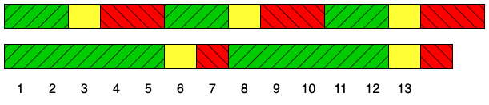
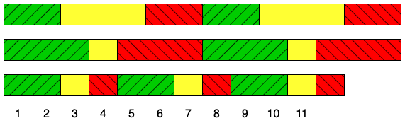

# 신호등 (Programmers - Level ?)

**출처:** 프로그래머스 | **링크:** [문제 링크]

---

## 문제 설명

어떤 도로에 차량 신호등이 n개 있습니다.  
모든 신호등은 항상 **초록불 → 노란불 → 빨간불** 순서로 반복되며, 각 신호의 지속 시간은 신호등마다 다릅니다.  
시간은 1초부터 시작하며, 각 신호등은 처음에는 초록불 상태로 시작합니다.

이 도로에서는 가끔 정전이 일어나는데, **모든 신호등이 동시에 노란불이 되면 정전이 발생**한다는 사실이 밝혀졌습니다.

예를 들어 신호등이 2개이고, 각 신호등의 주기가 아래와 같다고 가정합니다.

| 신호등 | 초록불 | 노란불 | 빨간불 |
|--------|--------|--------|--------|
| 1번    | 2초    | 1초    | 2초    |
| 2번    | 5초    | 1초    | 1초    |

위 그림과 같이 **13초**에 처음으로 두 신호등이 모두 노란불이 됩니다.

신호등 n개의 신호 주기를 담은 2차원 정수 배열 `signals`가 매개변수로 주어집니다.  
모든 신호등이 노란불이 되는 **가장 빠른 시각(초)** 을 return 하도록 `solution` 함수를 완성해 주세요.  
만약 모든 신호등이 노란불이 되는 경우가 존재하지 않는다면 **-1**을 return 해주세요.

---

## 제한 사항

- 2 ≤ `signals`의 길이 = n ≤ 5
- `signals`의 원소는 `[G, Y, R]` 형태의 길이 3인 정수 배열 (초록불, 노란불, 빨간불 지속 시간)
- 1 ≤ G, Y, R ≤ 18
- 3 ≤ G + Y + R ≤ 20

---

## 테스트 케이스 그룹

| 그룹 | 점수 | 추가 제한 사항 |
|------|------|----------------|
| #1   | 30%  | 정답이 20 이하 |
| #2   | 30%  | 정답이 반드시 존재 |
| #3   | 40%  | 없음 |

---

## 입출력 예시

| signals | result |
|---------|--------|
| `[[2, 1, 2], [5, 1, 1]]` | 13 |
| `[[2, 3, 2], [3, 1, 3], [2, 1, 1]]` | 11 |
| `[[3, 3, 3], [5, 4, 2], [2, 1, 2]]` | 193 |
| `[[1, 1, 4], [2, 1, 3], [3, 1, 2], [4, 1, 1]]` | -1 |

---

## 입출력 예 설명

**예 #1** — 문제 설명의 예시와 동일합니다.

**예 #2**

| 신호등 | 초록불 | 노란불 | 빨간불 |
|--------|--------|--------|--------|
| 1번    | 2초    | 3초    | 2초    |
| 2번    | 3초    | 1초    | 3초    |
| 3번    | 2초    | 1초    | 1초    |

11초에 3개의 신호등이 모두 노란불이 됩니다.

**예 #3** — 193초에 3개의 신호등이 모두 노란불이 됩니다.

**예 #4** — 모든 신호등이 동시에 노란불이 되는 경우가 없으므로 -1을 return 합니다.